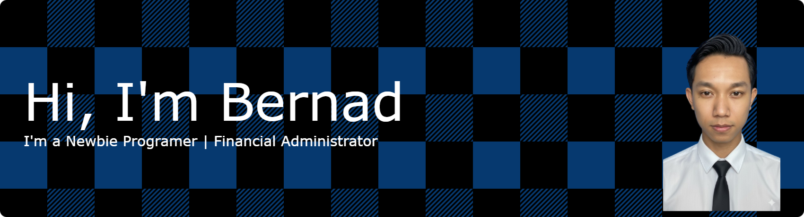

<!-- ## Hi there i'm Bernad👋

<!--
**BernadusWisnu/BernadusWisnu** is a ✨ _special_ ✨ repository because its `README.md` (this file) appears on your GitHub profile.

Here are some ideas to get you started:

- 🔭 I’m currently working on ...
- 🌱 I’m currently learning ...
- 👯 I’m looking to collaborate on ...
- 🤔 I’m looking for help with ...
- 💬 Ask me about ...
- 📫 How to reach me: ...
- 😄 Pronouns: ...
- ⚡ Fun fact: ...

--><h1 align="left">Hey 👋 What's up?</h1>

###

 

My name is Bernadus Wisnu, and I currently work as a Financial Administrator and a Warehouse Operations Staff. I’m from Yogyakarta.

###

<h2 align="left">About me</h2>

###

📚I'm currently focusing on learning HTML, CSS, and JavaScript. 🎯 Goals : Becoming a Front-End Specialist 🎲 Fun fact : I first learned HTML, CSS, and JavaScript back in vocational school. Although my career after graduation had nothing to do with coding, I recently rediscovered my passion for programming. Now, I’m committed to improving my skills and pursuing a career in front-end development.

###

<h2 align="left">I code with</h2>

###

  
  
  
  
  
  
  
  
  
  
  
  
  

###

###

  
  

###

  
  

###
